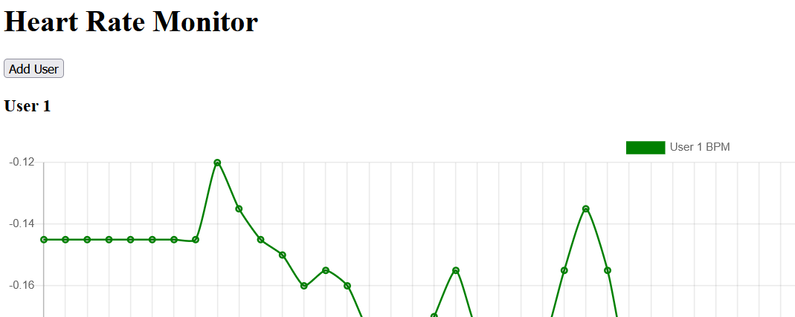
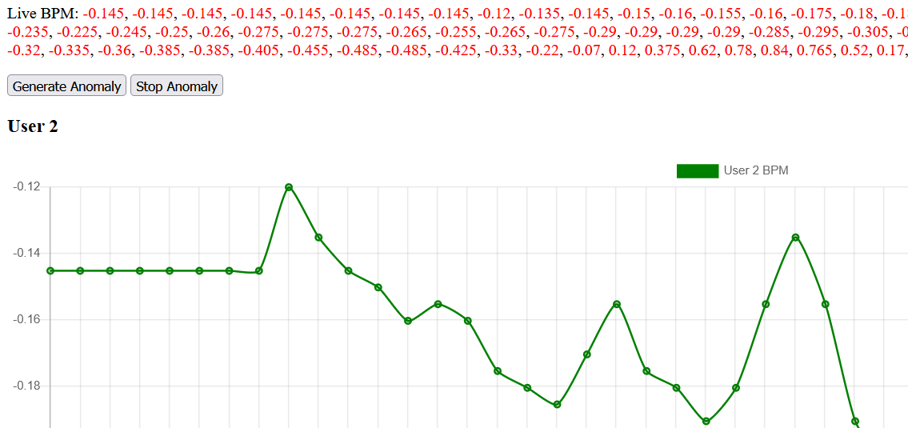
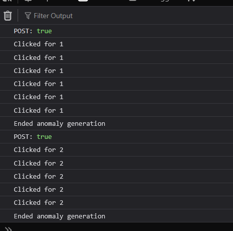

# Heart Monitoring Dashboard POC (Temporarly not working on it)

- **Aim** : To make a simple dasboard which displays the heart rate of different users in real-time

- **Motivation** : This was a small personal project to refresh my Python, Flask, HTML, JS skills. I decided to make a POC to simulate how a dashbaord from medical sensors can look like.

- **Features** (thus far) : 
    - Add users using a button to show a graph showing their heartbeat in real-time.
    - Press on anomaly button to show output in console.

- **Technical stuff** :
    - Application used for development - VSCode

    - Python modules used : 
        - keyboard
        - neurokit2 ; https://neuropsychology.github.io/NeuroKit/examples/ecg_delineate/ecg_delineate.html
        - Flask
        - schedule ; A simple to use API for scheduling jobs, made for humans
        - wfdb

    - Python Virtual Environment used.
        - Creating a Python Virtual Environment (In the console)
            - Go to your workspace directory
                cd ~/your/project/folder
            - Create a virtual environment named 'venv'
                python3 -m venv venv or py -m venv venv
            - Activate it:
                - On Linux/macOS:
                    source venv/bin/activate
                - On Windows:
                    venv\Scripts\activate
        - Running Flask : flask --app Main run (In the console)

    - CDN used :
        - https://cdnjs.cloudflare.com/ajax/libs/Chart.js/2.9.4/Chart.js

    - Errors + solutions
        - Issue : There are duplicates being printed.
        
            Turns out that the setInterval() function (In script.js) and the schedule.run_pending() time.sleep(1) function in the Main.py file are causing a race around condition.
            
            What's Happening?
            1. Python: schedule.run_pending() + time.sleep(1)
            This executes the scheduled task (like generating new BPM data) once per second. Let's say every 1 second, your sensor appends one new BPM value to a list for a user.
            2. JavaScript: setInterval(..., 1000)
            This fetches the data from the server every 1 second and updates the chart and display.
            3. Problem: Timing Overlap
            When both are synced too closely, this happens:
            At t = 2s, your Python sensor adds BPM = 90
            At the same t = 2s, the JavaScript fetch() call triggers, getting the updated array (now including 90)
            But in the next second, if your fetch() happens slightly after the next sensor update (due to processing lag, network latency, etc.), you may receive two values instead of one, or catch a partially updated list
            This can lead to:
            - Duplicated BPM values displayed
            - Skipped values
            - Out-of-sync chart vs. text
            - Appended old data repeatedly, especially if you’re tracking count and misalign due to a race condition
            
            - Solution : So what i did is just compare the time stamps and ensure that duplicates don't get printed, because the time stamps associated with the bpm remains the same throughout (the issue is being mainly caused by the js code, not the backend).
        
        - Issue : When clicking on the anomaly button, it would work only once, and not again.

            - What’s happening in each case?
                - bpmAnomalySimulation (without parentheses)

                You're passing a reference to the function, which tells the browser:

                    "When this button is clicked, call this function."

                So the function is called only when the event happens (on click), which is what you want.

                - bpmAnomalySimulation() (with parentheses)

                You're calling the function immediately, at the time of setting up the listener — not when the button is clicked.

                And whatever value that function returns (probably undefined) is what gets passed to addEventListener. So you're effectively doing this:

                anomalyButton.addEventListener("click", undefined); // <-- No function left to run

                So:

                    The function runs once immediately.

                    After that, there's no click handler left attached.

                    So nothing happens when you click the button.

                - Solution : Rule of Thumb

                    Never use parentheses when passing a function to addEventListener.

                    Unless you're using an anonymous function, like this:

                    anomalyButton.addEventListener("click", () => bpmAnomalySimulation(uid));

                    This is okay if you want to pass parameters or wrap something custom.
                    Correct Examples

                    // Simple reference
                    element.addEventListener("click", myFunction);

                    // Anonymous wrapper if passing arguments
                    element.addEventListener("click", () => myFunction(42));

- **Current Status** : Paused the project. Honestly, trying to study how anomaly in heartbeats work was a little difficult for me. I need to understand a little bit of the science behind the heartbeats, so I paused on it. Currently this project has partially achieved it's purpose. Possibly will have to revisit this project in the future.

- **Current Issues with the code** :
    - Not optimized : When adding users, there is a delay (didn't check if it was because of the time interval being set or whether there is some issue with the scheduling)
    - When we refresh the page, it doesn't start from the beginning. Understandable because I did not aim for it to restart. There is no such code checking for this.

- **Some snippets from the dashboard** :

